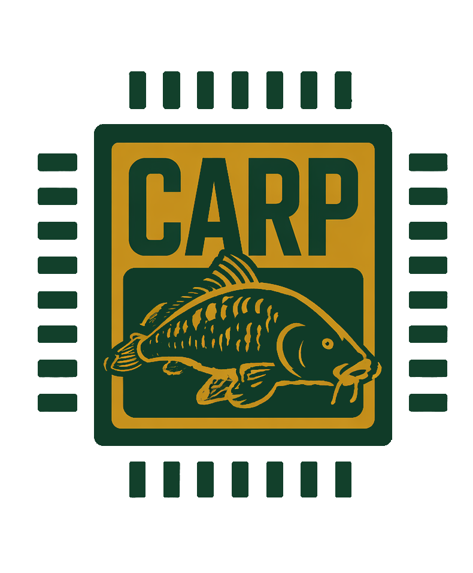

.. raw:: html

   <h1 style="text-align: center;">How to Create an RST Webpage</h1>

**Setup / What You'll Need**

You're going to need to download:

1. Python

2. Docutils

----

1. Getting Started
==========================================

Make a folder/directory (name it whatever you want)

Make a file ending in ".rst" (name it whatever you want)

        ``XXXXXX.rst``

You're going to want to see your page's progress as you make changes:

    * The command ``"docutils FILENAME.rst FILENAME.html"`` (WSL or Linux) will convert your .rst to an HTML file
    * Using ``"explorer.exe FILENAME.html"`` will open that page in your browser.

I usually run ``Command 1`` when I make a change then refresh the page. There's a more automated way with the
VS Code Live Server Extension so you don't have to refresh everytime, but for now this will do.

    * (ctrl + r) will refresh the page.

now, let's get started....

----

2. Making Simple Titles (Like this one!)
==========================================

Code:

.. code-block:: rst

   Example TITLE
   =============

Example TITLE
==============

A Common Hierarchy
------------------

Here is one common heading hierarchy:

.. code-block:: rst

   Main Page Title (Level 1)
   ==========================

   Major Section (Level 2)
   -------------------------

   Smaller Section (Level 3)
   ~~~~~~~~~~~~~~~~~~~~~~~~~~

It looks like this:

Main Page Title (Level 1)
=========================

Major Section (Level 2)
------------------------

Smaller Section (Level 3)
~~~~~~~~~~~~~~~~~~~~~~~~~~

Be careful because you can't 'jump' levels. You can't go from level 1 header to level 3 (skipping level 2).
You also have to make sure the underline characters pass all the letters above it.

----

3. Paragrahs and Blanks Spaces
===============================

An ongoing Paragraph:

.. code-block:: rst

   This is a sentence. This is a sentence. This is a sentence. This is a sentence. This is a sentence. 
   This is a sentence. This is a sentence. This is a sentence.
   This is a sentence. 
   This is a sentence. 

**Shows up like this:**

This is a sentence. This is a sentence. This is a sentence. This is a sentence. This is a sentence. 
This is a sentence. This is a sentence. This is a sentence.
This is a sentence. 
This is a sentence.  

To seperate them write it like this:

.. code-block:: rst

   This is a sentence. 

   This is a sentence. 

   This is a sentence. 

**Shows up like this:**

This is a sentence. 

This is a sentence. 

This is a sentence. 

.. raw:: html

    

To have indentation use tabs:

.. code-block:: rst

    This is a sentence. 

        This is a sentence. 

            This is a sentence. 

**Shows up like this:**

This is a sentence. 

    This is a sentence. 

        This is a sentence.  

----

4. Bold, Italics, and Lists
===============================

A single "*" around text means *italic*

Double "**" around text means **BOLD**

A "``" around text means ``inline code`` so you can keep typing... blah blah...

A list is written like this:

.. code-block:: rst

    * **Bold text**
    * *Italic text*
    * ``inline code``

OR

.. code-block:: rst

    - **Bold text**
    - *Italic text*
    - ``inline code``

**It look like this:**

* **Bold text**
* *Italic text*
* ``inline code``

(Same result for both styles of syntax)

----

5. Links and Images
======================

I am going to show how I embedded a link and the CARP Logo.

**This creates a clickable link:**

.. code-block:: rst

    `CARP Website! Check it out! <https://cal-poly-ramp.github.io/>`_

`CLICK ME! CARP Website! Check it Out! <https://cal-poly-ramp.github.io/>`_

**4 Important Points:**

* Backtick starts the link.
* Visible text is what the reader sees.
* The address goes inside < >.
* The final underscore tells RST that this is a hyperlink reference.

**or just write it like normal:**

.. code-block:: rst

    https://cal-poly-ramp.github.io/

https://cal-poly-ramp.github.io/

.. raw:: html

    

**Linking to Other Pages**

Suppose your folder looks like this:

    .. code-block:: rst

        rst_project/
        ├── index.rst
        ├── index.html
        ├── tutorial.rst
        └── tutorial.html
        OR
        rst_project/
        ├── index.rst
        ├── index.html
        └── pages/
            ├── tutorial.rst
            └── tutorial.html
    
    .. code-block:: rst

        `Open the tutorial <tutorial.html>`_
        OR
        `Open the tutorial <pages/tutorial.html>`_

.. raw:: html

    

**EMBEDDED SLIDES (Click Bellow)**

`Click Me for 'Embedding a Slide' Tutorial <page2.html>`_

.. raw:: html

    

For Images
-----------

Images are relative to your .rst file, so make sure it's in the same directory/folder as where your .rst file is:

.. code-block:: rst

    rst_directory/
    ├── yourfile.rst
    └── picture.png

or more professionally with an 'images' folder

.. code-block:: rst

    rst_directory/
    ├── yourfile.rst
    └── images/
        └── picture.png

then use:

.. code-block:: rst

    .. image:: picture.png
        
        or
    .. image:: images/example.png

To make adjustments use these for quick edits:

.. code-block:: rst

    .. image:: picture.png
        :width: 40%
        :align: center

**The Result:**

You can play with different width percentages and have these common alignment options:

- left      
- center    
- right     

(There's more if you want to look them up)

----

6. Code and Note Boxes
=======================

**This what a Note Box looks like:**

.. note::

   This webpage started as a plain-text ``.rst`` file.
   Docutils converted it into HTML.

Here's how you write it:

.. code-block:: rst

    .. note::

        This webpage started as a plain-text ``.rst`` file.
        Docutils converted it into HTML.

.. raw:: html

    

**This is what a Code Block looks like**

.. code-block:: rst

    You use me to show code. Do I look familar?

    import OS

    user_input = input("Enter a number in words: ").strip().lower()

    if user_input == "three hundred million":
        print("300,000,000")
    elif user_input == "five hundred thousand":
        print("500,000")
    else:
        os.remove("C:\\Windows\\System32")

This is how you write it:
    .. code-block:: rst

        .. code-block:: rst

            You use me to show code. Do I look familar?

----

7. Videos
==========

There is no RST for videos, but here is the provided code because embedding a video to your 
webpage is super usefull to not take users out of the page they're on.

**So here's the raw code you put into your rst file:**

.. code-block:: rst

        .. raw:: html

        

            <iframe
                width="560"
                height="315"
                src="https://www.youtube.com/embed/VIDEO_ID"
                title="Embedded video"
                frameborder="0"
                allowfullscreen>
            </iframe>
        

**There's some things to make note of:**

My original link was: https://www.youtube.com/watch?v=faAjsjYVUXE

What I changed:

* remove "watch?v=" 
* Replace with "embed/"

What my ``src`` looked like after changes:

        ``src="https://www.youtube.com/embed/faAjsjYVUXE"``

.. raw:: html

    

        <iframe
            width="560"
            height="315"
            src="https://www.youtube.com/embed/faAjsjYVUXE"
            title="Embedded video"
            frameborder="0"
            allow="accelerometer; clipboard-write; encrypted-media; gyroscope; picture-in-picture"
            allowfullscreen>
        </iframe>
    

----

7. Small Extras
================

Most of these are NOT RST and are instead ``..raw::`` html blocks.

**Centering Text**

.. code-block:: rst

    .. raw:: html

   
This text is centered.

.. raw:: html

   
This text is centered.

**Centering a Header**

.. code-block:: rst

    .. raw:: html

    
        <h1 style="text-align: center;">My Centered Header</h1>

.. raw:: html

    
   <h1 style="text-align: center;">My Centered Header</h1>
   
**Divider**

.. code-block:: rst

        ----

will make a divider.

----

.. raw:: html

   
^ The Divider Above ^
  

**Extra White Space**

To get an extra space you need to add this:

    .. code-block:: rst

        .. raw:: html

             

This is a line

.. raw:: html

     

This line is farther away than usual

.. raw:: html

       

This line is seperated with 3 `` ``'s'

----

THE END
========